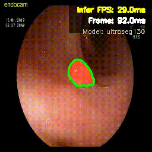
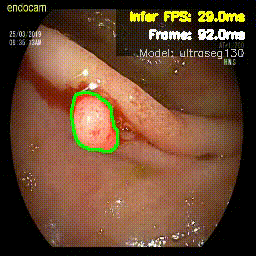

# UltraSeg Ultra-lightweight real-time polyp segmentation for CPU-only deployment

This article provides a real-time polyp segmentation model for colonoscopy videos that relies on CPU or edge devices with a parameter count of 130K.

Paper: Enabling Real-Time Colonoscopic Polyp Segmentation on Commodity CPUs via Ultra-Lightweight Architecture 
https://arxiv.org/abs/2602.04381

## Overview

UltraSeg establishes the first strong baseline for **extreme-compression** polyp segmentation (&lt;0.3M parameters), delivering **&gt;90 FPS on single-core CPU** with clinically viable accuracy.

- **UltraSeg-108K** (0.108M params): Optimized for single-center/single-modality data
- **UltraSeg-130K** (0.13M params): Enhanced for multi-center/multi-modal generalization

## Key Results

| Model | Params | Avg Dice | Single-Core FPS |
|-------|--------|----------|-----------------|
| UNet-Base | 31.0M | 0.839 | 1.6 |
| **UltraSeg-108K** | **0.108M** | **0.784** | **92.1** |
| **UltraSeg-130K** | **0.130M** | **0.793** | **90.3** |

*Evaluated on CVC-ClinicDB, Kvasir, PolypGen, PolypDB, and Kvasir-Instrument datasets.*

mixed dataset test of UltraSeg family and other models
| Method | Params (M) | FLOPs (G) | FPS (CPU) | Dice | vs UNet-B | Efficiency* |
|:-------|:----------:|:---------:|:---------:|:----:|:---------:|:-----------:|
| **UltraSeg-130K** | **0.13** | 0.15 | **90** | 0.8038 | 94.8% | **6.18** |
| UltraSeg-500K | 0.50 | 0.54 | 46 | 0.8389 | 98.9% | 1.67 |
| UltraSeg-1.11M | 1.11 | 1.15 | 25 | 0.8441 | 99.5% | 0.76 |
| **UltraSeg-4.38M** | **4.38** | 4.44 | 10 | **0.8647** | **101.9%** | 0.20 |
| UNet-B | 31.04 | 54.8 | 1.6 | 0.8478 | 100% | 0.027 |
| Polyp-PVT† | 25.11 | 10.02 | 7.5 | 0.8976 | 105.8% | 0.036 |

*\* Efficiency = Dice / Params (per million). Higher is better.*

† *ImageNet pre-training.*

## Examples of realtime CPU based Zero-Shot Video Segmentation

Real-time Inference on CPU (using my Windows System Standard Laptop)

## Quick Start
git clone https://github.com/AI-thpremed/ultraseg.git

## Contact

email: weihaomeva@163.com
